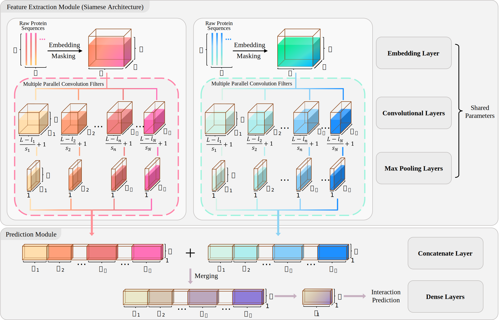

## DeepTrio: a ternary prediction system for protein–protein interaction using mask multiple parallel convolutional neural networks

            


<!--  -->

<!-- # Motivation
Protein-protein interaction (PPI), as a relative property, depends on two binding proteins of it, which brings a great challenge to design an expert model with unbiased learning and superior generalization performance. Additionally, few efforts have been made to grant models discriminative insights on relative properties. -->

## Updates

2023-06-08: v1.0.3 - v1.0.4: fix BUG in `main.py`, which clarifies the probability type of model output.<br />
2022-11-09: v1.0.2 - v1.0.3: fix some BUGs in `build_model_for_hyperparameter_search.py`, and change the command-line parameters for inputting data. `model.py` is renamed as `build_model.py`<br />
2022-05-11: v1.0.1 - v1.0.2: fix some BUGs in `model.py`, and change the command-line parameters for inputting data.<br />
<b>2021-11-09: Note for article: the title of Section 2.2.1 should be 'Protein sequence representation', and the reference in the footnote of Table 4 should be Chen <i>et al</i>. (2019).</b><br />
2021-09-03: v1.0.0 - v1.0.1: adding an alternative function for applying max-pooling on the outer-product of two protein feature maps.

## Overview



## Installation

It is recommended to install dependencies in **conda** virtual environment so that only few installation commands are required for running DeepTrio. 
You can prepare all the dependencies just by the following commands.

- Install Miniconda

    > Miniconda is a free minimal installer for conda. It is a small, bootstrap version of Anaconda that includes only conda, Python, the packages they depend on, and a small number of other useful packages, including pip, zlib and a few others

    1. Download Miniconda installer for linux : https://docs.conda.io/en/latest/miniconda.html#linux-installers
    2. Check the hashes for the Miniconda from : https://docs.conda.io/en/latest/miniconda_hashes.html
    3. Go to the installation directory and run command : `bash Miniconda3-latest-Linux-x86_64.sh`

- Creating the environment

    If there is no environment in your Miniconda environment, it is recommeneded to create a new environment to run DeepTrio.

    1. Run `conda create -n [your env name] python=3.7`
    2. Run `conda activate [your env name]`
    3. Run `pip install --upgrade pip`
    4. ~~Run conda install tensorflow-gpu=2.1~~  
       **WARNING: Using TensorFlow < 2.6.0 may have worse performance with the latest GPU like A100, and it is recommended to use pip to install the latest TensorFlow e.g. 2.12.0)**  
       Run `pip install --upgrade tensorflow`
    5. Run `conda install seaborn`
    6. Run `conda install -c conda-forge scikit-learn`
    7. Run `conda install -c conda-forge gpyopt`
    8. Run `conda install -c conda-forge dotmap`

### Run DeepTrio for Training

1. To run DeepTrio on your own training data you need to prepare the following two things:

    * Protein-protein Interaction File: A pure protein ID file, in which two protein IDs are separated by the **Tab** key, along with their label (1 for 'interacting', and 0 for 'non-interacting'). 

      ```txt
      line1:    protein_id_1  [Tab]  protein_id_2  [Tab]  label
      line2:    protein_id_3  [Tab]  protein_id_4  [Tab]  label
      ```

    * Protein Sequence Database File: A file containing protein IDs and their sequences in fasta format, which are separated by the **Tab** key. 
     
      ```txt
      line1:    protein_id_1  [Tab]  protein_1_sequence  
      line2:    protein_id_3  [Tab]  protein_2_sequence
      ```
2. Execute command with arguments in shell:

    ```shell
    python build_model.py [-h] [--interaction_data INTERACTION_DATA] [--sequence_data SEQUENCE_DATA] [--fold_index FOLD_INDEX]
                         [--epoch EPOCH] [--outer_product OUTER_PRODUCT] [--cuda]
    ```
    for example:
    ```shell
    python build_model.py --interaction_data data/benchmarks/yeast\ core\ dataset\ from\ DeepFE-PPI/action_pair.tsv --sequence_data data/benchmarks/yeast\ core\ dataset\ from\ DeepFE-PPI/action_dictionary.tsv
    ```
    **Arguments:**

    |Argument|Required|Default|Description|
    | ----  | ----  |  ----  |----  |
    | --interaction_data | Yes || The customized name of your Protein-protein Interaction File with its path|
    | --sequence_data | Yes || The customized name of your Protein Sequence Database File with its path|
    | --fold_index | No |0| The fold index in 5-fold cross-validation|
    | --outer_product | No |False| Whether apply max-pooling on outer-product of two proteins|
    | --epoch | No |50| The maximum number of epochs|
    | --cuda | No |False| Allow GPU to perform training process|
    | --help | No || Help message|

### Run DeepTrio for hyper-parameter searching

1. To run DeepTrio on your own training data and search hyper-parameters, you need to prepare the following two things:

    * Protein-protein Interaction File: A pure protein ID file, in which two protein IDs are separated by the **Tab** key, alonge with their label (1 for 'interacting', 0 for 'non-interacting' and 2 for 'single protein'). ~~This file must be named as [(your customized name).pair.tsv]. For example:~~

      ```txt
      line1:    protein_id_1  [Tab]  protein_id_2  [Tab]  label
      line2:    protein_id_3  [Tab]  protein_id_4  [Tab]  label
      ```

    * Protein Sequence Database File: A file containing protein IDs and their sequences in fasta format, which are separated by the **Tab** key. ~~This file must be named as [(your customized name).seq.tsv]. For example:~~
     
      ```txt
      line1:    protein_id_1  [Tab]  protein_1_sequence  
      line2:    protein_id_3  [Tab]  protein_2_sequence
      ```
      
2. Execute command with arguments in shell:

    ```shell
    python build_model_for_hyperparameter_search.py [-h] [--interaction_data INTERACTION_DATA] [--sequence_data SEQUENCE_DATA]
                                                    [--epoch EPOCH] [--outer_product OUTER_PRODUCT] [--cuda]
    ```
    for example:
    ```shell
    python build_model_for_hyperparameter_search.py --interaction_data data/benchmarks/yeast\ core\ dataset\ from\ DeepFE-PPI/action_pair.tsv --sequence_data data/benchmarks/yeast\ core\ dataset\ from\ DeepFE-PPI/action_dictionary.tsv --cuda
    ```
    
    **Arguments:**

    |Argument|Required|Default|Description|
    | ----  | ----  |  ----  |----  |
    | --interaction_data | Yes || The customized name of your Protein-protein Interaction File with its path|
    | --sequence_data | Yes || The customized name of your Protein Sequence Database File with its path|
    | --epoch | No |100| The maximum number of epochs|
    | --cuda | No |False| Allow GPU to perform training process|
    | --help | No || Help message|


3. Select the best model according to **GpyOpt** log file:

    ```txt
    DeepTrio_search_1.h5
    DeepTrio_search_2.h5
    DeepTrio_search_3.h5
    DeepTrio_search_4.h5
    ...
    search_log.txt
    ```
    * The `search_log.txt` shows the details of all the candidate models' parameters and the best model parameters.
    <br />

    ```txt
    result: 
        parameter   em_dim:         15.0
        parameter   sp_drop:        0.005
        parameter   kernel_rate_1:  0.16
        ...
        evaluation: 0.9795729
    ```

### Run DeepTrio for Prediction
1. To run DeepTrio for prediction on your own query protein pairs you need to prepare the following three things:

    * The first protein File: It can contain multiple proteins in fasta format. For example:

      ```txt
      line1:    >protein_id_1
      line2:    protein_1_sequence
      line3:    >protein_id_2
      line4:    protein_2_sequence
      ```

    * The second protein File: It can contain multiple proteins in fasta format. For example:
     
      ```txt
      line1:    >protein_id_3
      line2:    protein_3_sequence
      ```
    
    * The model file name and its path. 

    * The inputs of DeepTrio will be:

      ```txt
      the first query protein pair:   protein_1 and protein_3
      the second query protein pair:  protein_2 and protein_3
      ```

2. Execute command with arguments in shell:

    ```shell
    python main.py [-h] -p1 PROTEIN1 -p2 PROTEIN2 -m MODEL [-o OUTPUT]
    ```
    **Arguments:**

    |Abbreviation|Argument|Required|Description|
    |  ----   | ----  | ----  |----  |
    | -p1  | --protein1 | Yes | The first protein group in fasta format with its path|
    | -p2  | --protein2 | Yes | The second protein group in fasta format with its path|
    | -m | --model | Yes | The DeepTrio model with its path|
    | -o | --output | No | The output file name|
    | -h  | --help | No | Help message|

### Run DeepTrio for Visualization
1. To run DeepSol for visualization on your own query protein pairs you need to prepare the following three things:

    * The first protein File: which must contain only one protein in fasta format. For example:

      ```txt
      line1:    >protein_id_1
      line2:    protein_1_sequence
      ```

    * The second protein File: which must contain only one protein, like `the first protein File`. 

    * The model file name and its path.

2. Execute command with arguments in shell:

    ```shell
    python visual_DeepTrio.py [-h] -p1 PROTEIN1 -p2 PROTEIN2 -m MODEL
    ```
    **Arguments:**

    |Abbreviation|Argument|Required|Description|
    |  ----   | ----  | ----  |----  |
    | -p1  | --protein1 | Yes | The first protein group in fasta format with its path|
    | -p2  | --protein2 | Yes | The second protein group in fasta format with its path|
    | -m | --model | Yes | The DeepTrio model with its path|
    | -h  | --help | No | Help message|

# FAQ

#### 1. Can I use pip to install the environment dependencies?

A) Yes, you need to install some addtional libraries, like GPU drivers, matplotlib, numpy, Gpy and so on, so we recommend to use conda to install dependencies.

#### 2. Can DeepTrio run on Windows?

A) Yes, you can configure conda virtual environment on your Windows PC.

#### 3. If I am not good at using Unix software, is there any conventient way to use DeepTrio?

A) Yes, you can visit our online website : http://bis.zju.edu.cn/deeptrio, where you can predicti PPIs and draw importance maps on the DeepTrio model without any configurations.

# Citation

If you find DeepTrio useful, please consider citing our publication:

Hu, X., Feng, C., Zhou, Y., Harrison, A., & Chen, M. (2021). DeepTrio: a ternary prediction system for protein-protein interaction using mask multiple parallel convolutional neural networks. <i>Bioinformatics</i>, btab737.
